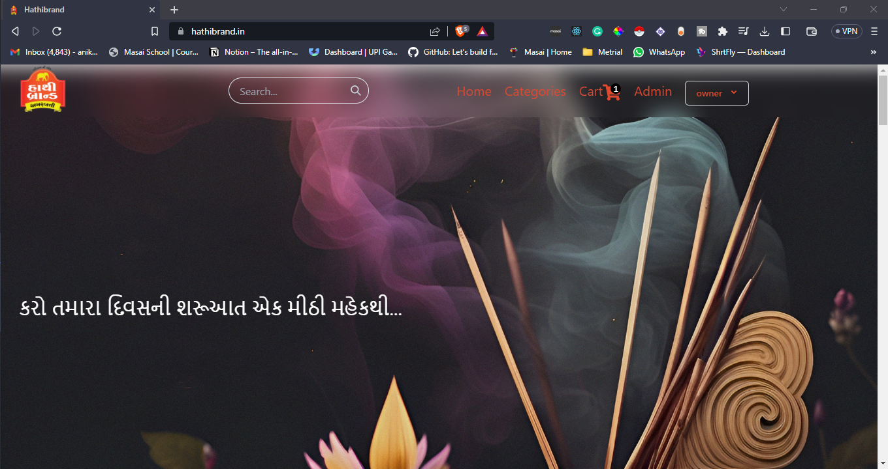
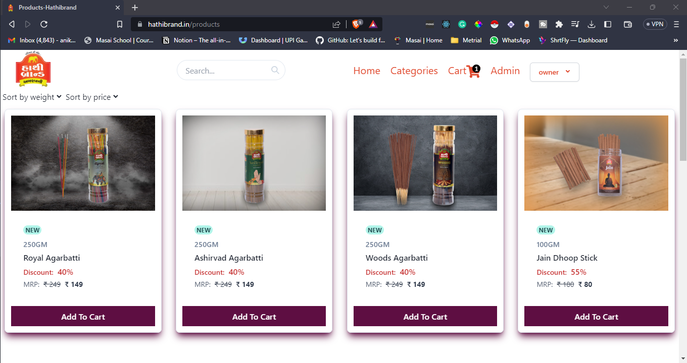
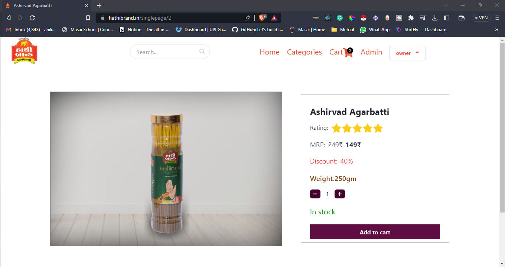
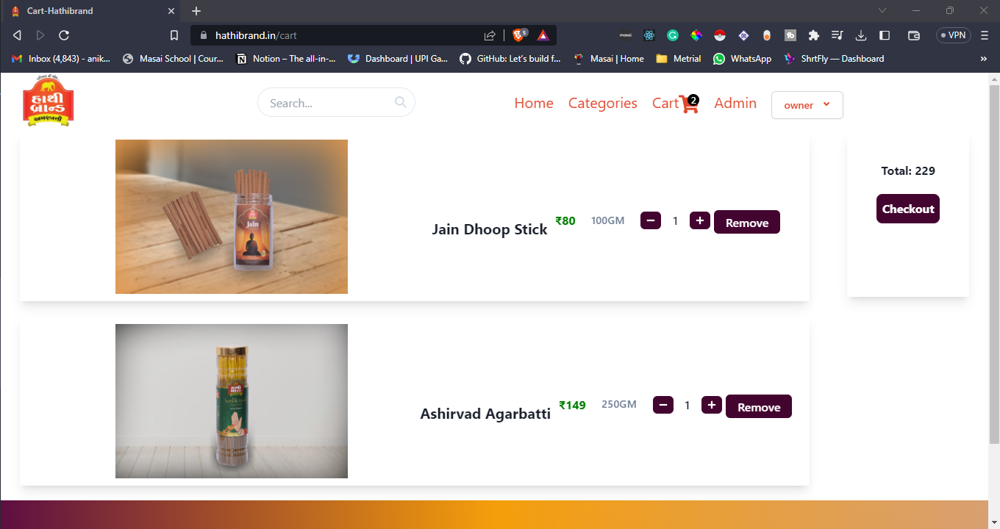
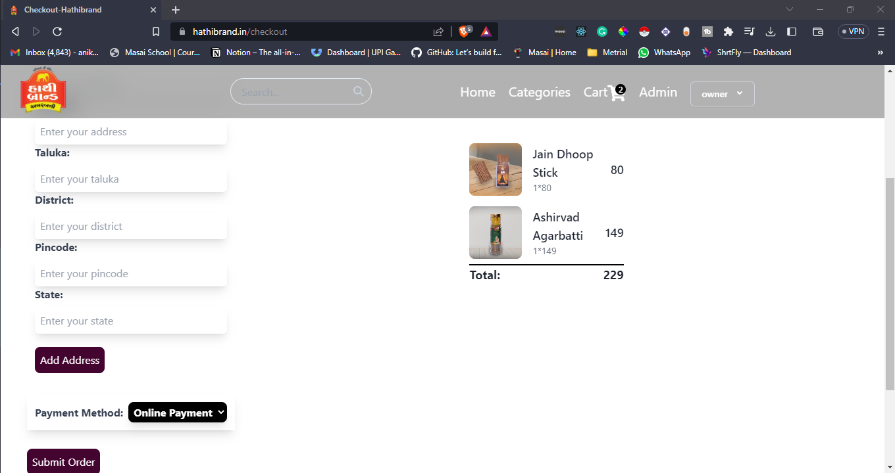
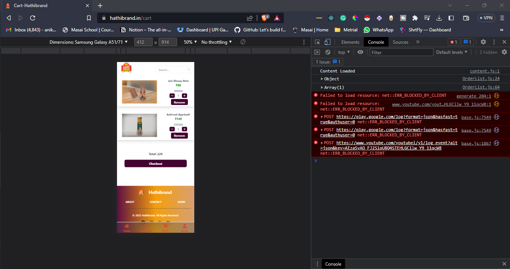
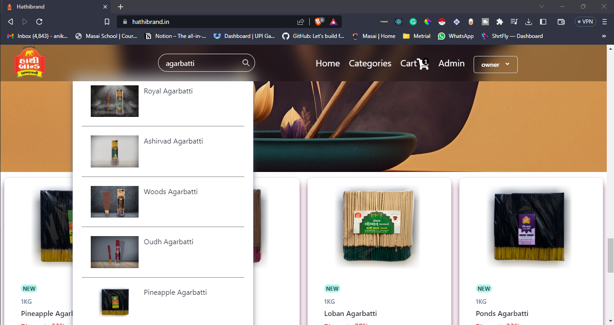
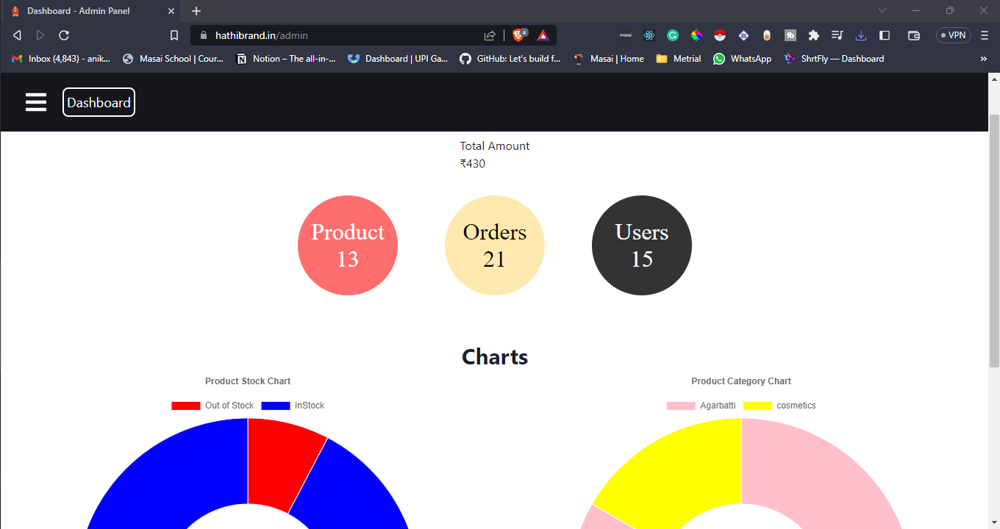

## Hathibrand 
---

About
Hathibrand is an online shop for premium quality incense sticks and cosmetics

### Tech-Stack
___

* Reactjs
* Chakra UI
* Tailwind css
* javascript
* Mysql
* redux
* Nodejs
* Hostinger
* Express

### Features
___
* User Authentication
* User Details Management 
* Show Details.
* Sorting, Filtering, and 
* Admin Panel
* Backend Api
* Cart
* Seach
* Resposive
* Checkout
* Invoice

### Fuctionality worked on-

| Team members | Functionality |
| ------ | ------ |
| Aniket Parmar | Admin Panel, Redux, Backend, Cart, Checkout, Authentication  |
| Krishna Kevadiya | Ui , Search  |

### Screenshots
___

<h2>Home Page</h2>

<h2>Login Page</h2>

<h2>Product Page</h2>

<h2>Single Product Page</h2>

<h2>footer part</h2>

<h2>Cart Page</h2>

<h2>Checkout Page</h2>

<h2>Resposive</h2>

<h2>Search</h2>

<h2>Admin Page</h2>

